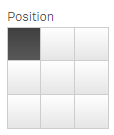

#  align-matrix component

**align-matrix Component**
<table style="font-family: Calibri; border-collapse: collapse;">
	<tr>
		<td>

		</td>
		<td>
The align-matrix component is implemented with the Text & Image chart visualization; We were unable to find supporting documentation in the Qlik's Help pages, Google's search were futile as well.  

<b>Motivation:</b> 
I am currently developing an extension where this component will be very helpful, but I found something surprising when studying its behaviour, because its returned values seems to be out of whack! You may notice that by looking at the table below.
		</td>
	</tr>
</table>
Yes, the returned values do not match the align-matrix's physical selector, still, this should not prevent us from using it, beside, we can handle them as internal tokens in our implementation, our users will never realize the existence of this feature. 
 
<table style="font-family: Calibri; border-collapse: collapse;">
  <tr style="font-family: Tahoma; font-size: 13px; background-color: #bfbfbf;">
	<th>Position</th>
	<th>Value</th>
	<th>Position</th>
	<th>Value</th>
	<th>Position</th>
	<th>Value</th>
  </tr>
  <tr>
	  <td>

      </td>
	  <td>topLeft</td>
	  <td>

	  </td>
	  <td>topCenter</td>
	  <td>
	  
	  </td>
	  <td>topRight</td>
  </tr>
  <tr>
	  <td>

      </td>
	  <td>centerLeft</td>
	  <td>

	  </td>
	  <td>centerCenter</td>
	  <td>
	  
	  </td>
	  <td>centerRight</td>
  </tr>
  <tr>
	  <td>

      </td>
	  <td>bottomLeft</td>
	  <td>

	  </td>
	  <td>bottomCenter</td>
	  <td>
	  
	  </td>
	  <td>bottomRight</td>
  </tr>
</table>
They are not correct, so we need to map the returned values to the appropriated ones, as shown next (because it is easier for use to handle what the visual selector shows): 

<table style="font-family: Calibri; border-collapse: collapse;">
   <tr style="font-family: Tahoma; font-size: 13px; background-color: #bfbfbf;">
	  <td>Mapping Position</td>
	  <td>JavaScript Code</td>
   </tr>
   <tr>
	<td>
<table style="font-family: Calibri; border-collapse: collapse;">
   <tr style="font-family: Tahoma; font-size: 13px; background-color: #bfbfbf;">
	  <td>Returned Vaue</td>
	  <td>Good Value</td>
   </tr>
   <tr><td>topLeft</td><td>topLeft</td></tr>
   <tr><td>centerLeft</td><td>topCenter</td></tr>
   <tr><td>bottomLeft</td><td>topRight</td></tr>
   <tr><td>topCenter</td><td>centerLeft</td></tr>
   <tr><td>centerCenter</td><td>centerCenter</td></tr>
   <tr><td>bottomCenter</td><td>centerRight</td></tr>
   <tr><td>topRight</td><td>bottomLeft</td></tr>
   <tr><td>centerRight</td><td>bottomCenter</td></tr>
   <tr><td>bottomRight</td><td>bottomRight</td></tr>
</table>
    </td>
    <td>
var myTranslateAlignment = { 
&nbsp;&nbsp;&nbsp;&nbsp;topLeft:      "topLeft", 
&nbsp;&nbsp;&nbsp;&nbsp;centerLeft:   "topCenter", 
&nbsp;&nbsp;&nbsp;&nbsp;bottomLeft:   "topRight", 
&nbsp;&nbsp;&nbsp;&nbsp;topCenter:    "centerLeft", 
&nbsp;&nbsp;&nbsp;&nbsp;centerCenter: "centerCenter", 
&nbsp;&nbsp;&nbsp;&nbsp;bottomCenter: "centerRight", 
&nbsp;&nbsp;&nbsp;&nbsp;topRight:     "bottomLeft", 
&nbsp;&nbsp;&nbsp;&nbsp;centerRight:  "bottomCenter", 
&nbsp;&nbsp;&nbsp;&nbsp;bottomRight:  "bottomRight", 
};
	</td>
   </td>
</table>
**What is the risk involved by implementing the align-matrix component with this mapping?** 
You may wonders about the risk of implementing the align-matrix component, more so when it is hard to find  documents explaining its features, on the other hand, this component in part of the Text & Image visualization, one of the earliest Qlik Sense's visualizations, which is probably implemented in so many solutions.

In my opinion this component is unlikely to be retired or deprecated anytime soon, its presence in a key visualization almost guarantee its existence, even with the glitch previously described. 

**Styling, text and image alignment in CSS:** 
 There are an important amount of topics, blogs, and questions regarding implementing image alignments on web pages, which tells us it has been challenging, fortunately we located a well documented solution at Stack Overflow and we are sharing it in this document. 

**How images alignments on web pages are achieve?** 