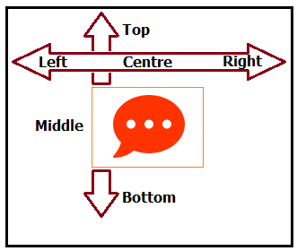

#  align-matrix component

**align-matrix Component**
<table style="font-family: Calibri; border-collapse: collapse;">
	<tr>
		<td>

		</td>
		<td>
The align-matrix component is implemented with the Text & Image chart visualization; We were unable to find supporting documentation in the Qlik's Help pages, Google's search were futile as well.  

<b>Motivation:</b> 
I am currently developing an extension where this component will be very helpful, but I found something surprising when studying its behaviour, because its returned values seems to be out of whack! You may notice that by looking at the table below.
		</td>
	</tr>
</table>
Yes, the returned values do not match the align-matrix's physical selector, still, this should not prevent us from using it, beside, we can handle them as internal tokens in our implementation, our users will never realize the existence of this feature. 
 
<table style="font-family: Calibri; border-collapse: collapse;">
  <tr style="font-family: Tahoma; font-size: 13px; background-color: #bfbfbf;">
	<th>Position</th>
	<th>Value</th>
	<th>Position</th>
	<th>Value</th>
	<th>Position</th>
	<th>Value</th>
  </tr>
  <tr>
	  <td>

      </td>
	  <td>topLeft</td>
	  <td>

	  </td>
	  <td>topCenter</td>
	  <td>
	  
	  </td>
	  <td>topRight</td>
  </tr>
  <tr>
	  <td>

      </td>
	  <td>centerLeft</td>
	  <td>

	  </td>
	  <td>centerCenter</td>
	  <td>
	  
	  </td>
	  <td>centerRight</td>
  </tr>
  <tr>
	  <td>

      </td>
	  <td>bottomLeft</td>
	  <td>

	  </td>
	  <td>bottomCenter</td>
	  <td>
	  
	  </td>
	  <td>bottomRight</td>
  </tr>
</table>
They are not correct, so we need to map the returned values to the appropriated ones, as shown next (because it is easier for use to handle what the visual selector shows): 

<table style="font-family: Calibri; border-collapse: collapse;">
   <tr style="font-family: Tahoma; font-size: 13px; background-color: #bfbfbf;">
	  <td>Mapping Position</td>
	  <td>JavaScript Code</td>
   </tr>
   <tr>
	<td>
<table style="font-family: Calibri; border-collapse: collapse;">
   <tr style="font-family: Tahoma; font-size: 13px; background-color: #bfbfbf;">
	  <td>Returned Vaue</td>
	  <td>Good Value</td>
   </tr>
   <tr><td>topLeft</td><td>topLeft</td></tr>
   <tr><td>centerLeft</td><td>topCenter</td></tr>
   <tr><td>bottomLeft</td><td>topRight</td></tr>
   <tr><td>topCenter</td><td>centerLeft</td></tr>
   <tr><td>centerCenter</td><td>centerCenter</td></tr>
   <tr><td>bottomCenter</td><td>centerRight</td></tr>
   <tr><td>topRight</td><td>bottomLeft</td></tr>
   <tr><td>centerRight</td><td>bottomCenter</td></tr>
   <tr><td>bottomRight</td><td>bottomRight</td></tr>
</table>
    </td>
    <td>
var myTranslateAlignment = { 
&nbsp;&nbsp;&nbsp;&nbsp;topLeft:      "topLeft", 
&nbsp;&nbsp;&nbsp;&nbsp;centerLeft:   "topCenter", 
&nbsp;&nbsp;&nbsp;&nbsp;bottomLeft:   "topRight", 
&nbsp;&nbsp;&nbsp;&nbsp;topCenter:    "centerLeft", 
&nbsp;&nbsp;&nbsp;&nbsp;centerCenter: "centerCenter", 
&nbsp;&nbsp;&nbsp;&nbsp;bottomCenter: "centerRight", 
&nbsp;&nbsp;&nbsp;&nbsp;topRight:     "bottomLeft", 
&nbsp;&nbsp;&nbsp;&nbsp;centerRight:  "bottomCenter", 
&nbsp;&nbsp;&nbsp;&nbsp;bottomRight:  "bottomRight", 
};
	</td>
   </td>
</table>
**What is the risk involved by implementing the align-matrix component with this mapping?** 
You may wonders about the risk of implementing the align-matrix component, more so when it is hard to find  documents explaining its features, on the other hand, this component in part of the Text & Image visualization, one of the earliest Qlik Sense's visualizations, which is probably implemented in so many solutions.

In my opinion this component is unlikely to be retired or deprecated anytime soon, its presence in a key visualization almost guarantee its existence, even with the glitch previously described. 

**Styling, text and image alignment in CSS:** 
 There are an important amount of topics, blogs, and questions regarding implementing image alignments on web pages, which tells us it has been challenging, fortunately we located a well documented solution at Stack Overflow and we are sharing it in this document. 

**How images alignments on web pages are achieve?** 
 

Neither HTML nor Cascade Style Sheets features a single property allowing us to position an image in a two dimensional area, it is not possible to assign vertical and horizontal alignments with a single property syntax, further more, the properties assigning vertical and horizontal alignments are written different; We achieve horizontal alignments with the text-align property, while vertical-align does the vertical alignment.

Additionally, we do not apply these alignment properties to the same HTML tags, actually 3 different tags are involved, e.g. &#60;div>; &#60;span> and &#60;img>.

We found this pattern at Stack Overflow in this topic: <a href="https://stackoverflow.com/questions/7273338/how-to-vertically-align-an-image-inside-a-div">How to vertically align an image inside a div</a>, the same topic leads us to a <a href="http://jsfiddle.net/kizu/4RPFa/4570/">jsfiddle's demo code: jsfiddle same for vertically aligning an image inside a division</a>.

**Prove of concept with the alignmatrix extension:** 
We wrote the **alignmatrix** prototype *extension* as a prove of concept on implementing the *alignmatrix* component in our extensions, it is not a fully develop extension, it should help you on understanding its implementation.

The *alignmatrix* extension implement a basic visualization template with the properties required to select an image (from Qlik's Media Library) and render it applying your alignments selections.

Before we implement the code to render our image with the chosen alignment, we need to know the properties to use with each HTML tag; the code found in the **jsfiddle** link is shown below: 

<table style="font-family: Courier New; border-collapse: collapse; font-size:11px;">
  <tr>
    <td>
&#60;div class=frame> 
&nbsp;&nbsp; &nbsp;&#60;span class="helper">&#60;/span>&#60;img src="http://jsfiddle.net/img/logo.png" height=250 /> 
&#60;/div>
    </td>
  </tr>
</table>
The **&#60;div>** tag implements the **css** class ***frame***, which looks like this:
<table style="font-family: Courier New; border-collapse: collapse; font-size:11px;width:500px;">
  <tr>
    <td>
.frame { 
&nbsp;&nbsp;&nbsp;&nbsp;height: 100px;      /* equals max image height */ 
&nbsp;&nbsp;&nbsp;&nbsp;width: 160px; 
&nbsp;&nbsp;&nbsp;&nbsp;border: 1px solid red; 
&nbsp;&nbsp;&nbsp;&nbsp;white-space: nowrap;  
&nbsp;&nbsp;&nbsp;&nbsp;text-align: center; margin: 1em 0; 
}
    </td>
  </tr>
</table>
Notice the *text-align* property, confirming that the **&#60;div>** tag handles the horizontal alignment; now let's take a look at the ***helper*** class, which is applied to the **&#60;span>** tag. 
<table style="font-family: Courier New; border-collapse: collapse; font-size:11px; width:500px;">
  <tr>
    <td>
.helper { 
&nbsp;&nbsp;&nbsp;&nbsp;display: inline-block; 
&nbsp;&nbsp;&nbsp;&nbsp;height: 100%; 
&nbsp;&nbsp;&nbsp;&nbsp;vertical-align: middle; 
}
    </td>
  </tr>
</table>
This class exposes the fact that the vertical alignment is handled by the **&#60;span>** tag; finally we ought to check the css definition for the **&#60;img>** tag.
<table style="font-family: Courier New; border-collapse: collapse; font-size:11px; width:500px;">
  <tr>
    <td>
img { 
&nbsp;&nbsp;&nbsp;&nbsp;background: #3A6F9A; 
&nbsp;&nbsp;&nbsp;&nbsp;vertical-align: middle; 
&nbsp;&nbsp;&nbsp;&nbsp;max-height: 25px; 
&nbsp;&nbsp;&nbsp;&nbsp;max-width: 160px; 
}
    </td>
  </tr>
</table>
We completed exploring how the vertical and horizontal alignments are applied, there are other properties present.

This confirm that our extension should split the code assigning the properties for alignments, we introduced two variables doing so.
<table style="font-family: Courier New; border-collapse: collapse; font-size:11px; width:650px;">
   <tr style="font-family: Tahoma; font-size: 13px; background-color: #bfbfbf;">
	  <td><b>Horizontal Alignments</b></td>
	  <td><b>Vertical Alignments</b></td>
   </tr>
  <tr>
    <td>
var myH_Alignments = { 
&nbsp;&nbsp;&nbsp;&nbsp;topLeft:      "text-align: left;", 
&nbsp;&nbsp;&nbsp;&nbsp;centerLeft:   "text-align: left;", 
&nbsp;&nbsp;&nbsp;&nbsp;bottomLeft:   "text-align: left;", 
&nbsp;&nbsp;&nbsp;&nbsp;topCenter:    "text-align: center;", 
&nbsp;&nbsp;&nbsp;&nbsp;centerCenter: "text-align: center;", 
&nbsp;&nbsp;&nbsp;&nbsp;bottomCenter: "text-align: center;", 
&nbsp;&nbsp;&nbsp;&nbsp;topRight:     "text-align: right;", 
&nbsp;&nbsp;&nbsp;&nbsp;centerRight:  "text-align: right;", 
&nbsp;&nbsp;&nbsp;&nbsp;bottomRight:  "text-align: right;", 
};
    </td>
    <td>
var myV_Alignments = { 
&nbsp;&nbsp;&nbsp;&nbsp;topLeft:      "vertical-align: top;", 
&nbsp;&nbsp;&nbsp;&nbsp;centerLeft:   "vertical-align: middle;", 
&nbsp;&nbsp;&nbsp;&nbsp;bottomLeft:   "vertical-align: bottom;", 
&nbsp;&nbsp;&nbsp;&nbsp;topCenter:    "vertical-align: top;", 
&nbsp;&nbsp;&nbsp;&nbsp;centerCenter: "vertical-align: middle;", 
&nbsp;&nbsp;&nbsp;&nbsp;bottomCenter: "vertical-align: bottom;", 
&nbsp;&nbsp;&nbsp;&nbsp;topRight:     "vertical-align: top;", 
&nbsp;&nbsp;&nbsp;&nbsp;centerRight:  "vertical-align: middle;", 
&nbsp;&nbsp;&nbsp;&nbsp;bottomRight:  "vertical-align: bottom;", 
};	
    </td>
  </tr>
</table>
Our code assign an ID to our image's HTML tag when rendering it, this id includes the extension's instance id (**layout.qInfo.qId**) using the extension's instance id to create any extension's object guarantee we can include several instances of our extension without clashes between them. 
<pre>
var myqInfoqId = layout.qInfo.qId;
var myImage_Id = 'img_' + myqInfoqId;
</pre>
This is the code that dynamically creates the HTML that renders the image in the browser.

<pre style="font-size: 12px;">
var myRTAlignment = myTranslateAlignment[layout.myproperties.myImageAlignment];

// rendering
// extension container header adjustments

$("div[tid='" + myqInfoqId + "'").find("header.qv-object-header").hide(); // hider header
$("div[tid='" + myqInfoqId + "'").find("div.qv-object-nav.ng-isolate-scope.inline").hide();
if(layout.myproperties.myImagePadding) {
	$("div[tid='" + myqInfoqId + "'").find("div.qv-inner-object.no-titles").css({"padding": ""});
} else {
	$("div[tid='" + myqInfoqId + "'").find("div.qv-inner-object.no-titles").css({"padding": "0px"});
}

// get image html
if(!isEmpty(layout.myproperties.myImage)) {
    myHTML  = '&#60;div style="height: 100%; width: 100%; ' + myH_Alignments[myRTAlignment] + '">';
    myHTML += '&#60;span style="display:inline-block; height: 100%; vertical-align: middle;">';
	
    myHTML += '&#60;img id="' + myImage_Id + '" src="' + layout.myproperties.myImage + '" style="' + myV_Alignments[myRTAlignment] + ' max-height: 300px;" border="1">';
    myHTML   += '&#60;/div>';
}

$element.html(myHTML);
//needed for export
return qlik.Promise.resolve();
</pre>
It hides the extension's header and navigation selector, observe that the jQuery searches for the object with a tid equal to the extension's instance Id (myqInfoqId) ensuring it hides objects inside the extension's HTML code.

It also toggles the image's padding inside the extension, we have a property that enables this feature.
<table style="font-family: Courier New; border-collapse: collapse; font-size:11px; width:650px;">
   <tr style="font-family: Tahoma; font-size: 13px; background-color: #bfbfbf;">
	  <td><b>Image Alignment: Top-Left</b></td>
	  <td><b>Image Alignment: Bottom-Right</b></td>
   </tr>
  <tr>
    <td>

    </td>
	<td>

	</td>
  </tr>
</table>
